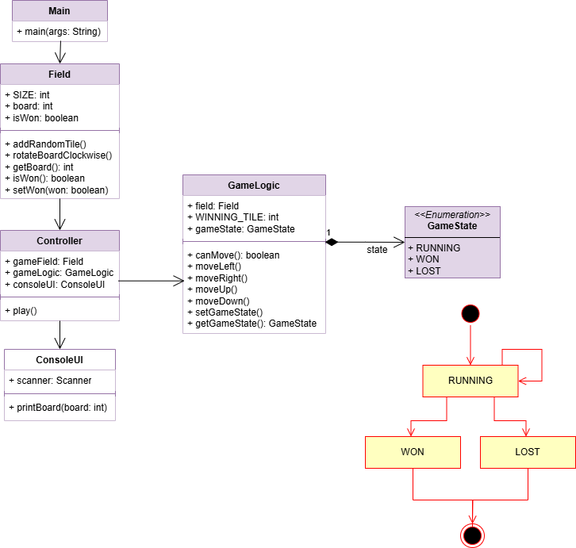
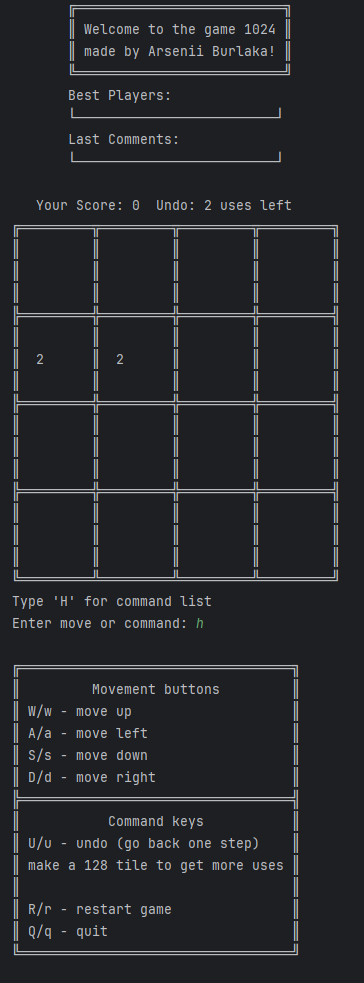
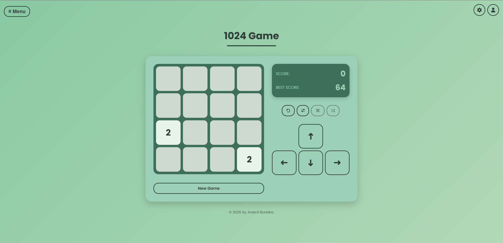
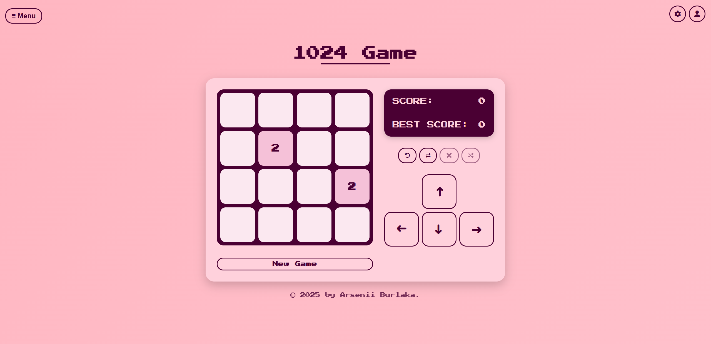

# 1024

* **Youtube video link for first project defense:** https://youtu.be/q9he3uMhmq4

* **Youtube video link for second project defense:** https://youtu.be/lvDfhIhPsEE

* **Youtube video link for third project defense:** https://youtu.be/R2nu60jqMoA



## Project Description

1024 is an educational Java project built with Spring Boot that implements the popular tile-matching puzzle game "1024". The project showcases the development of a multi-layered application featuring a REST API, web and console user interfaces, a rating system, comments, and user management.

## Key Features

* **Game Logic**: Core mechanics for merging tiles to reach the 1024 tile.
* **User Interfaces**:

    * Web version built with HTML/CSS/JavaScript (`1024.html`).
    * Console application (`ConsoleUI.java`) for quick testing and demonstrations.
* **Services**:

    * Ratings (`RatingService`), comments (`CommentService`), scores (`ScoreService`), and user management (`UserService`).
    * Implementations using JDBC, JPA, and REST clients for external interactions.
* **Themes**: Switch between light and dark modes using `theme-switcher.js`.
* **REST API**: Predefined requests available in `gamestudio.http` for managing `scores`, `comments`, `ratings`, and `users`.

## Interface Demonstrations






## Architecture and Project Structure

The project follows a multi-layered architecture:

1. **core** — business logic and models (`Field`, `GameLogic`, `GameState`).
2. **controller** — request handling and interaction between UI and services.
3. **services** — interfaces and implementations for database access and external services.
4. **entity** — JPA entities (`Score`, `Comment`, `Rating`, `User`).
5. **UI** — console-based interface.
6. **resources** — static assets and Thymeleaf templates.

```

├── src
│   ├── main
│   │   ├── java
│   │   │   ├── core
│   │   │   ├── controller
│   │   │   ├── entity
│   │   │   ├── services
│   │   │   ├── server
│   │   │   ├── UI
│   │   │   ├── Main
│   │   │   └── SpringClient
│   │   └── resources
│   │       ├── static
│   │       │   ├── css/style.css
│   │       │   └── js
│   │       └── templates
│   └── test
└── README.md (this file)
```


## Configuration

Default properties in `application.properties`:

```properties
spring.datasource.url=Your URL
spring.datasource.username=postgres
spring.datasource.password=Your Password
spring.datasource.hikari.maximumPoolSize=10

remote.server.api=http://localhost:8080/api

spring.mail.host=smtp.gmail.com
spring.mail.port=587
spring.mail.username=Your Mail
spring.mail.password=Your Key
```
Adjust these settings as necessary.

## Contact

* **Author**: Arsenii Burlaka
* **E-mail**: [arseniy.burlaka.2005@gmail.com](mailto:arseniy.burlaka.2005@gmail.com)

*Thank you for your interest in and contributions to this project!*