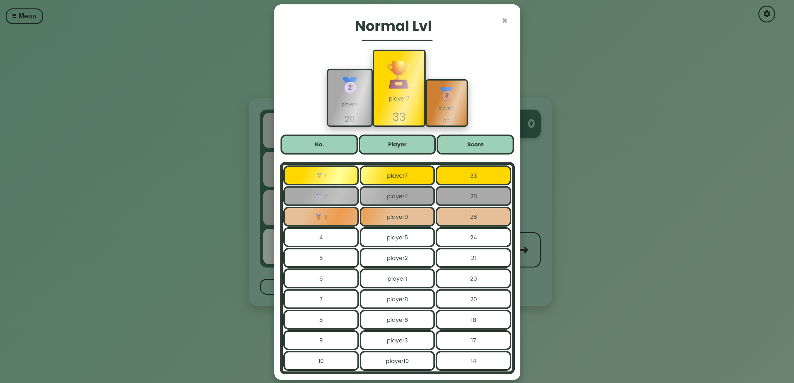
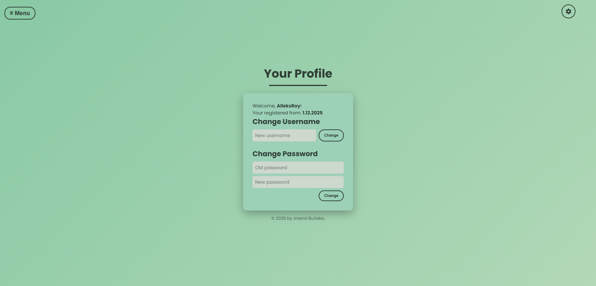

# 🧩 1024 Game Studio


> **A comprehensive full-stack implementation of the 1024 puzzle game built with Spring Boot.**
---

## Key Features
* **Dual Interface Support**:
    * **Web UI**: Responsive interface built with HTML5, CSS3, JavaScript, and Thymeleaf.
    * **Console UI**: A standalone text-based interface for logic testing and minimal resource usage.
* **Robust Backend**: Built on Spring Boot with a strict separation of concerns (MVC pattern).
* **REST API**: Fully exposed endpoints for managing scores, ratings, comments, and users.
* **Data Persistence**: Integrated PostgreSQL database using Spring Data JPA and JDBC.
* **Services**:
    * Ratings
    * comments
    * scores
    * user management
* **User Experience**: Features include global leaderboards, commenting systems, rating logic, and theme switcher.

---

## 🛠 Tech Stack

| Layer | Technologies |
| :--- | :--- |
| **Backend** | Java 17, Spring Boot (Web, Data JPA, JDBC), REST API |
| **Frontend** | Thymeleaf, HTML5, CSS3, JavaScript (ES6+) |
| **Database** | PostgreSQL |
| **Build & Tools** | Maven, Git, IntelliJ IDEA, Postman |

---

## 📸 Interface Preview
### Web User Interface
*Features a responsive design and theme switching capability.*

|                         Gameplay                          |
|:---------------------------------------------------------:|
|  |
|    |

|                 Hall of Fame & Comments                  |
|:--------------------------------------------------------:|
|       |
|  |

|                         Profile                         |
|:-------------------------------------------------------:|
|  |


### Console User Interface
*Lightweight interface for direct logic interaction.*

|                       Console UI                        |
|:-------------------------------------------------------:|
|  |

---

## Architecture and Project Structure

The project follows a multi-layered architecture:

1. **core** — Logic (Game mechanics, Field management). Independent of frameworks. (`Field`, `GameLogic`, `GameState`).
2. **controller** — request handling and interaction between UI and services.
3. **services** — interfaces and implementations for database access and external services.
4. **entity** — JPA entities (`Score`, `Comment`, `Rating`, `User`).
5. **UI** — console-based interface.
6. **resources** — static assets and Thymeleaf templates.

```

├── src
│   ├── main
│   │   ├── java
│   │   │   ├── core
│   │   │   ├── controller
│   │   │   ├── entity
│   │   │   ├── services
│   │   │   ├── server
│   │   │   ├── UI
│   │   │   ├── Main
│   │   │   └── SpringClient
│   │   └── resources
│   │       ├── static
│   │       │   ├── css/style.css
│   │       │   └── js
│   │       └── templates
│   └── test
└── README.md (this file)
```

---

## ⚙️ Getting Started
Follow these instructions to set up the project locally.

### Prerequisites
* **Java Development Kit (JDK)** (Version 17)
* **Maven**
* **PostgreSQL**

### Installation
1.  **Clone the repository**

2. **Create a PostgreSQL database and update the `src/main/resources/application.properties` file with your credentials:**

    ```properties
    # Database Configuration
    spring.datasource.url=jdbc:postgresql://localhost:5432/YOUR_DB_NAME
    spring.datasource.username=postgres
    spring.datasource.password=YOUR_PASSWORD
    
    # HikariCP Settings
    spring.datasource.hikari.maximumPoolSize=10
    
    # API Configuration
    remote.server.api=http://localhost:8080/api
    
    # Mail Settings (Optional - for notifications)
    spring.mail.host=smtp.gmail.com
    spring.mail.port=587
    spring.mail.username=YOUR_EMAIL
    spring.mail.password=YOUR_APP_KEY
    ```
3.  **Build and Run**
    ```bash
    mvn spring-boot:run
    ```
4.  **Access the Application**
    Open your browser: [http://localhost:8080/](http://localhost:8080/)

## 📺 Video Demo
Check out the comprehensive demonstration of the final project features and gameplay:

▶️ **[Watch Final Presentation on YouTube](https://youtu.be/R2nu60jqMoA)**

---
*(Development History: [Milestone 1 Defense](https://youtu.be/q9he3uMhmq4) | [Milestone 2 Defense](https://youtu.be/lvDfhIhPsEE))*
## Contact

* **Author:** Arsenii Burlaka
* **E-mail:** [arseniy.burlaka.2005@gmail.com](mailto:arseniy.burlaka.2005@gmail.com)

*Thank you for your interest in and contributions to this project!*